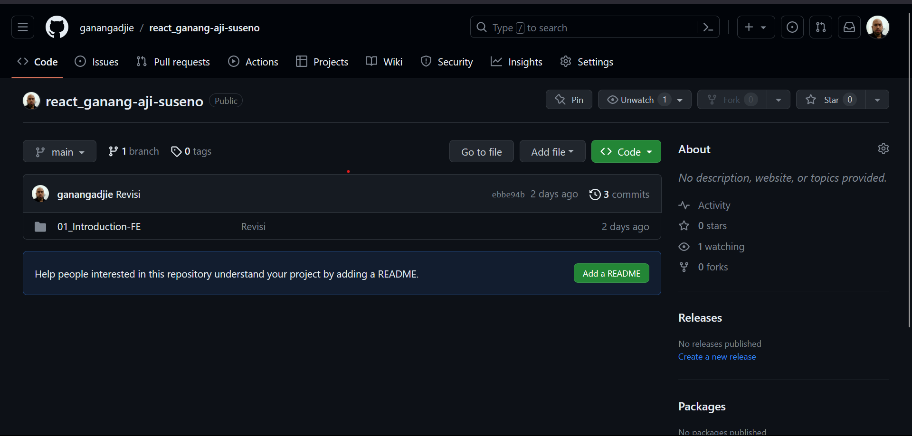

- Soal Prioritas 1
1. Buatlah sebuah repository github yang sesuai dengan namaKelas_namaKalian

2. Buatlah folder yang berurutan dan diberi nama sesuai dengan nama soal yang kalian kerjakan.

3. Pada setiap folder akan berisikan sub folder lagi

- Soal Prioritas 2
1. Buatlah branch baru pada github yang kalian buat

2. Lakukan Pull Request pada branch tersebut sehingga akan menambah hal baru pada branch main/master
